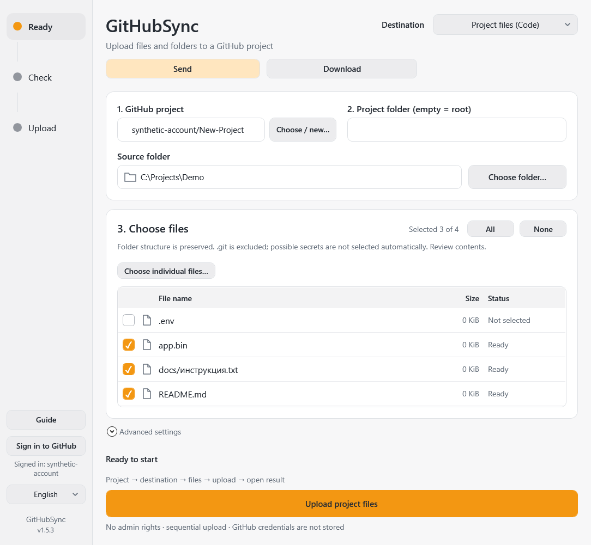
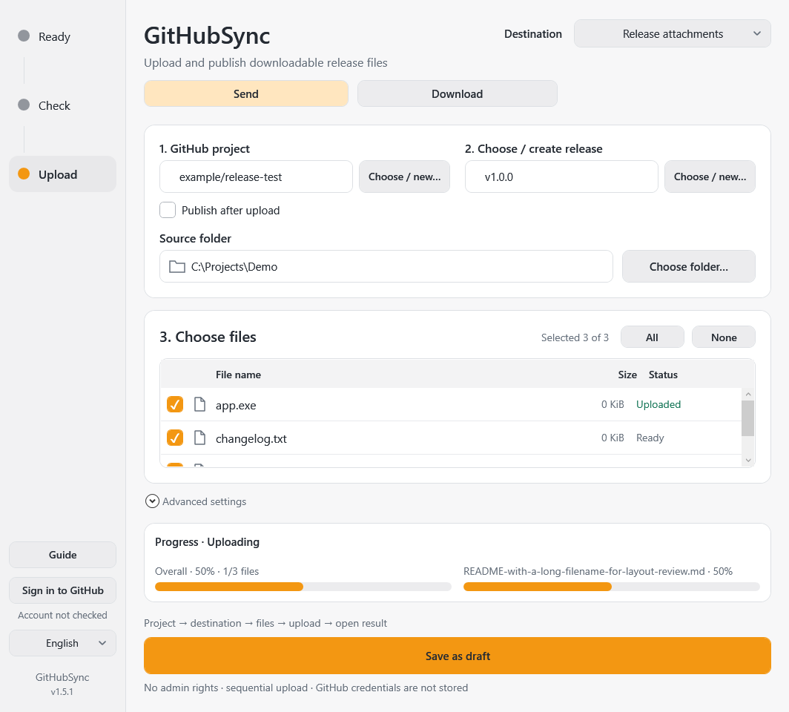
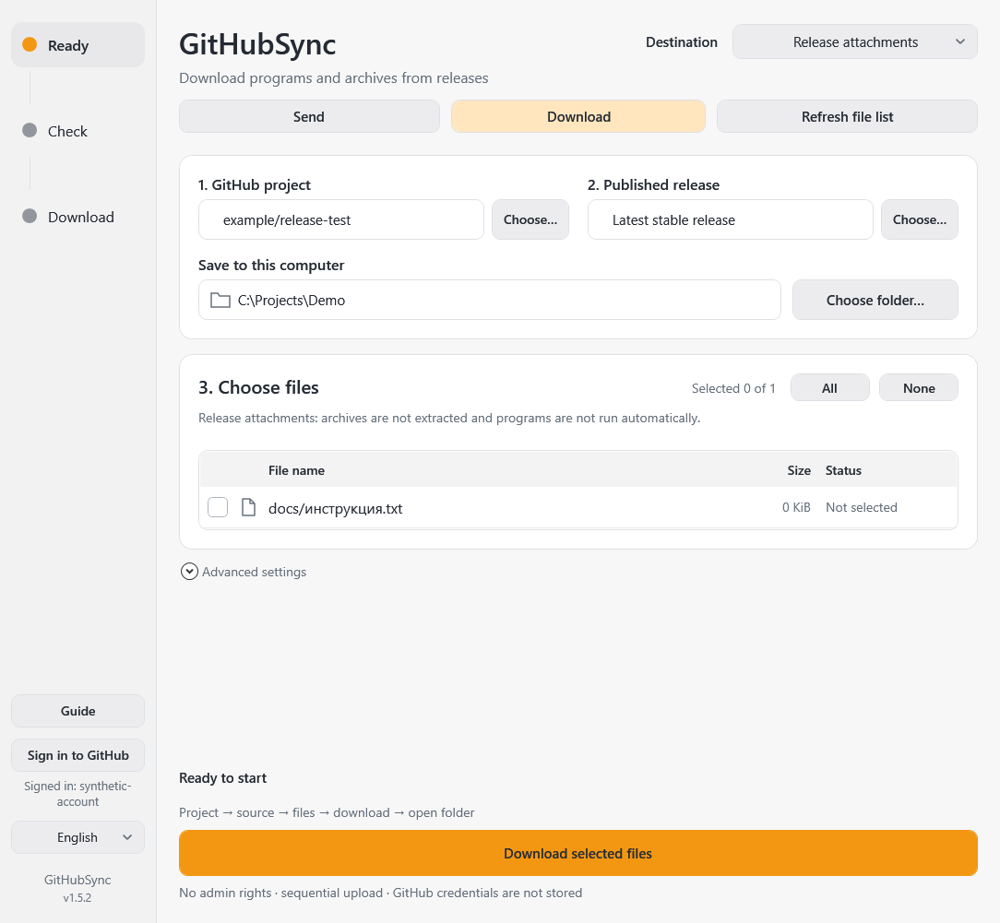

# GitHubSync

Send files to GitHub, download project files or release attachments, resume downloads, and receive update notifications. Transfers always require approval.

Windows 10/11 · x64 · **1.5.2 local release candidate** · Deutsch / Русский / English

[Deutsch](docs/README.de.md) · [Русский](docs/README.ru.md) · [User guide](docs/Guide-en.html) · [Security](SECURITY.md)

## First steps

Verify the ZIP against its `.sha256`, extract the **entire** portable folder and open `GitHubSync.exe`. No installer or administrator rights. Git/Git Credential Manager are bundled; Windows PowerShell 5.1 and .NET Framework 4.6.2 or later (4.8 recommended) with WPF must be available.

Sign in through the official browser, select/create a project, choose a destination, review files, confirm upload, then open the result. Google/SMS/2FA stays in the browser. Folder reading runs in the background; switching mode/folder cancels the old scan. Incomplete lists cannot be uploaded.

Choose **Send** or **Download** first. Public downloads do not require signing in. For Download, paste a repository link, select **Project files (Code)** or **Release attachments**, refresh the file list, choose a local folder, select files and review replacements before confirming. Code downloads preserve paths below the selected GitHub folder and are pinned to a commit; release downloads use the latest stable published version unless another version is selected.

**Pause download** retains partial files. **Resume download…** restores the selection for a fresh review. Byte resume depends on server range support; a full response restarts that file instead of appending. Completed files are checked against available hashes; missing release digests are reported as size-only verification. Replacements have backups; unrelated local files are never deleted.

The close button hides the app in the **system tray** and approved transfers continue. Double-click to reopen; use **Exit** in the tray to quit. The two-arrow icon animates in the tray and window during transfer. Checks run every 15 minutes for one selected GitHub source while the app is running. Notifications never start a transfer. Windows autostart is not enabled.

## Two destinations

- **Project files:** files appear in **Code**, preserving nested relative paths. Review Added/Updated/Unchanged before one commit. No deletion of other files, no force-update or empty commit. A changed/protected branch stops the operation.
- **Release attachments:** select/create a **release draft**. Publish after upload on means explicit upload-and-publish confirmation after all attachments are verified; off saves an unpublished draft. Publish later separately, open the release and copy page/file links. Published releases are not edited.

Private remains private: publishing a release does not change repository visibility. Creating a project defaults to private.

## Screenshots

These are actual WPF demonstration renders with artificial files, fictional accounts and neutral paths, not screenshots of a real GitHub transfer.

| Project files | Release attachments |
| --- | --- |
|  |  |

## Requirements and limitations

Code files above 100 MiB are rejected before writing; use Release attachments. Git LFS is not configured. `.git`/links are excluded; likely credential filenames do not start selected, but **review contents yourself**. `.gitignore` is not applied automatically. Internet and appropriate GitHub permissions are required. An empty existing repository needs an initial README/commit. Repositories created in this app get one.

OneDrive Cloud placeholders are supported; real symlinks/junctions and unknown reparse tags are still blocked. Code transfers use the configured HTTP deadline (three hours by default), show streamed byte progress, and report safe operation/HTTP-status diagnostics without logging server bodies or credentials.

This candidate is locally prepared, not yet claimed as a published release. Backend/API checks use mocks and artificial files. Current-version real Code commit/release publication, other PCs, physical DPI switching and real network-interruption acceptance have not been performed. A timeout/unknown write result requires checking GitHub before retrying.

Git LFS objects, submodules and Git history are not downloaded. Unsupported Windows filenames, links/junctions and unsafe paths stop the operation. GitHub blob API downloads have a 100 MiB limit. Uploads cannot byte-resume an unfinished release attachment: already confirmed files are skipped, the unfinished file is sent again.

## Privacy

`config.json`, `ui-settings.json` and error logs beside the extracted EXE may contain local paths, selected filenames and the account name: **do not publish them**. The app does not store tokens in these files; GCM manages authorized credentials separately in the user's credential store. No telemetry service is added. Git ignores generated apps/dependencies, local preferences, logs and keys; publication auditing checks the actual Git file set.

Resumable task metadata is private under `%LOCALAPPDATA%/GitHubSync`. Partial files and replacement backups are in `.githubsync` below the chosen download folder; this directory is excluded from uploads and source archives. No authentication token or signed CDN URL is stored there.

## Build and release files

See [CONTRIBUTING](CONTRIBUTING.md) for commands and folder structure. `Run-Checks.ps1` uses mocked GitHub/auth only. `tools/Build-Portable.ps1` builds locally and creates:

- `artifacts/GitHubSync-1.5.2-Portable/GitHubSync.exe`
- `artifacts/GitHubSync-1.5.2-win-x64.zip`
- the accompanying `.zip.sha256`

Generated artifacts are **not** source commits. Upload the ZIP/checksum as release attachments only after owner approval. This preparation does not create a GitHub repository, push, publish a release or deploy Pages. [Release notes](docs/RELEASE_NOTES-1.5.2.md) · [Verification](docs/VERIFICATION-1.5.2.md) · [Release checklist](docs/RELEASE_CHECKLIST.md) · [Architecture](docs/ARCHITECTURE.md) · [Design](docs/DESIGN.md) · [Changelog](CHANGELOG.md) · [Security](SECURITY.md).

## Rights

Existing application license: [MIT](LICENSE). Bundled Git/GCM and libraries retain their [independent licenses and source references](THIRD_PARTY.md). These must not be removed from a distributed portable package. Reports are welcome in German, Russian or English; redact personal information first.
