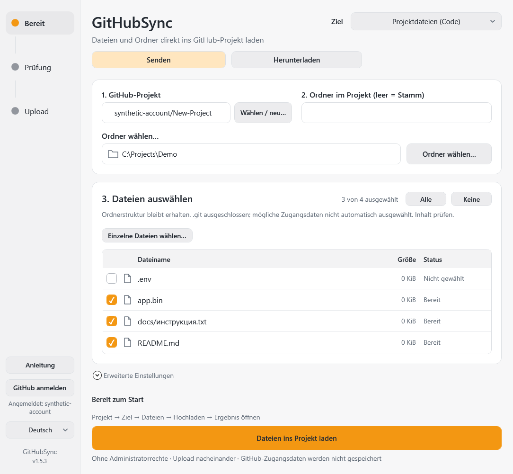
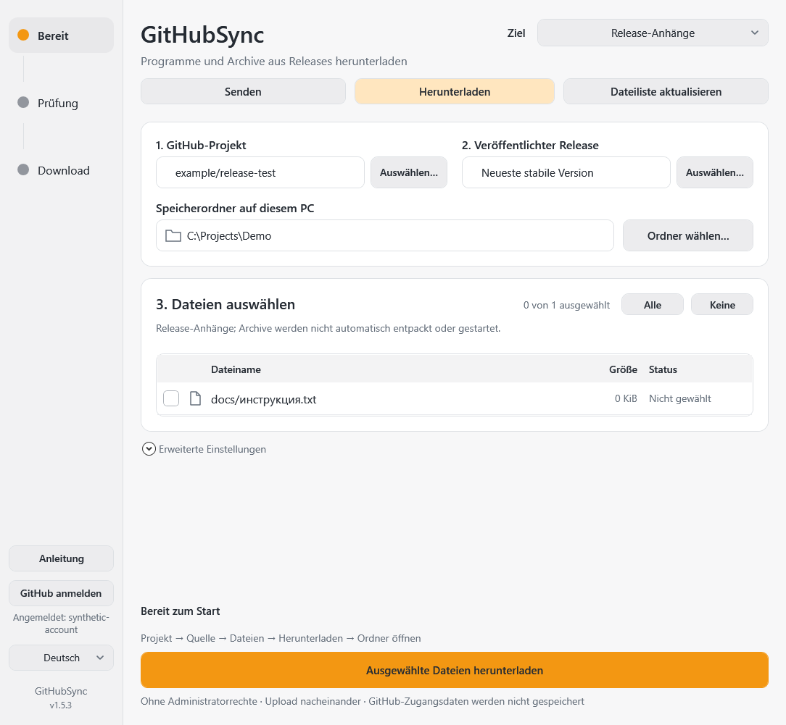

# GitHubSync

Dateien zu GitHub senden, herunterladen und fortsetzen. Hinweise auf Updates starten keine Übertragung.

Windows 10/11 · x64 · 1.5.3 · Deutsch / Русский / English

[English](../README.md) · [Русский](README.ru.md) · [HTML-Anleitung](Guide-de.html)

## Erste Schritte

Zuerst **Senden** oder **Herunterladen** wählen. Code enthält Projektdateien, Releases enthalten fertige Programme und Archive. Öffentliche Downloads brauchen keine Anmeldung: GitHub-Link einfügen, Dateiliste aktualisieren, Speicherordner und Dateien wählen, Änderungen bestätigen. Die vollständige Anleitung ist [offline verfügbar](Guide-de.html).

Schließen blendet das Fenster in den Infobereich aus; bestätigte Übertragungen laufen weiter. Doppelklick öffnet das Fenster. Beenden erfolgt im Tray-Menü. Downloads lassen sich pausieren und nach erneuter Prüfung fortsetzen. Update-Hinweise starten keine Übertragung.

Gesamte Portable-ZIP entpacken, SHA-256 prüfen und `GitHubSync.exe` öffnen. Kein Installer oder Administratorrecht nötig. Git/Git Credential Manager sind enthalten; Windows PowerShell 5.1 und .NET Framework müssen verfügbar sein. Anmeldung einschließlich Google/SMS/2FA erfolgt im offiziellen Browser. Projekt auswählen/erstellen, Zielmodus wählen, Dateien prüfen, Upload ausdrücklich bestätigen und Ergebnis öffnen.

Echter WPF-Render mit künstlichen Dateien, Beispielkonto und neutralem Pfad; keine persönlichen Daten. Ordnerlesen läuft im Hintergrund und kann durch Ordner-/Moduswechsel abgebrochen werden.

## Zwei Ziele

- **Projektdateien:** rekursive relative Pfade, Vorschau Neu/Ersetzen/Unverändert, ein Commit in bestehenden Branch. Keine Löschungen, kein force, kein Leercommit. Geänderter/geschützter Branch stoppt den Vorgang.
- **Release-Anhänge:** Entwurf wählen/erstellen; Checkbox schaltet zwischen Entwurf speichern und Hochladen/veröffentlichen nach Bestätigung aller Anlagen. Spätere separate Veröffentlichung und Links zu Release/Dateien. Veröffentlichte Releases werden nicht verändert.

Privat bleibt privat; eine Veröffentlichung ändert die Repository-Sichtbarkeit nicht. Projekt-Erstellung ist standardmäßig privat.

## Grenzen und Datenschutz

Code-Dateien über 100 MiB ablehnen; Senden → Release-Anhänge verwenden. Kein automatisches Git LFS. `.git`/Links ausgeschlossen, mögliche Geheimnisse nicht vorausgewählt; Inhalte dennoch selbst prüfen. `.gitignore` wird nicht automatisch angewendet. Einstellungen und Fehlerlog neben der EXE können lokale Pfade, Dateinamen und Konto enthalten: nicht veröffentlichen. Tokens werden dort nicht gespeichert; GCM verwaltet Anmeldung. Git ignoriert generierte Artefakte, Runtime, Einstellungen, Logs und Schlüssel.

## Prüfung und Rechte

Lokal vorbereiteter Kandidat 1.5.3, keine öffentliche Veröffentlichung. Code-Uploads verwenden das gebündelte Git statt großer base64-REST-Anfragen: ein Commit, keine Löschung anderer Dateien, kein force. Ein temporärer Branch-Snapshot verändert nicht den gewählten lokalen Ordner. Git-Objektfortschritt ist keine Dateibestätigung; Erfolg erst nach Commitprüfung auf GitHub. Das Tray-Menü wird nicht mehr jede Sekunde neu aufgebaut. Offline-Prüfungen und separat genehmigte künstliche TEST-Abnahme stehen in der [Prüfung 1.5.3](VERIFICATION-1.5.3.md). Andere PCs und physischer DPI-Wechsel bleiben unbestätigt.

Release-Dateien: `GitHubSync-1.5.3-win-x64.zip` und `.sha256`. [Build/Struktur](../CONTRIBUTING.md), [Offline-Anleitung](Guide-de.html), [MIT](../LICENSE) und [Drittherstellerhinweise](../THIRD_PARTY.md).
