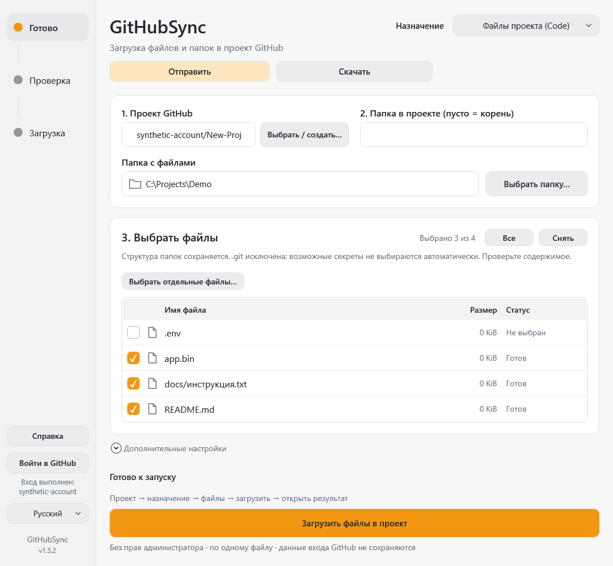
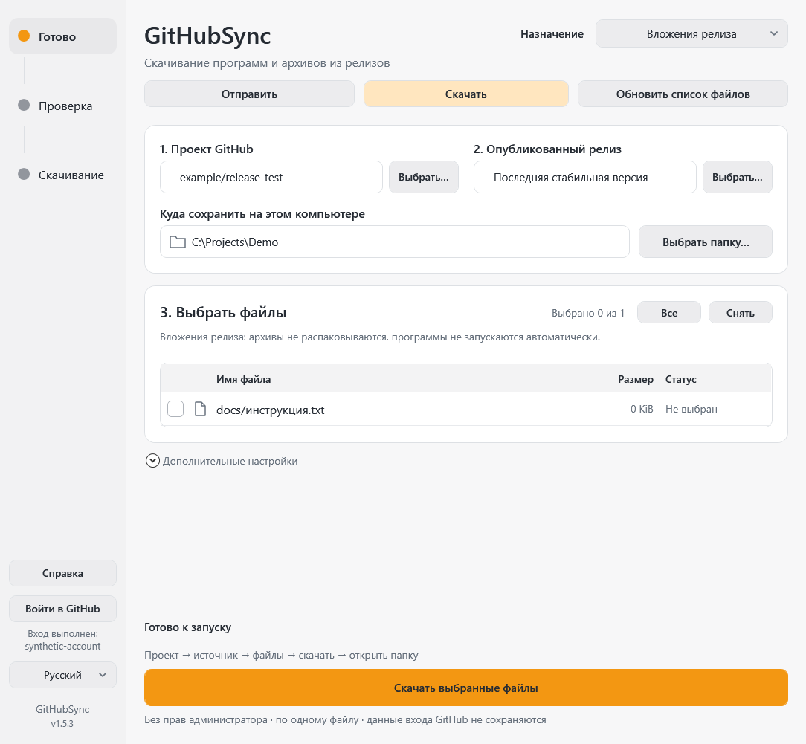

# GitHubSync

Отправляйте файлы на GitHub и скачивайте их обратно с проверкой и докачкой. Изменения обнаруживаются автоматически, передача — только с вашего разрешения.

Windows 10/11 · x64 · 1.5.2 · Deutsch / Русский / English

[English](../README.md) · [Deutsch](README.de.md) · [HTML-инструкция](Guide-ru.html)

## Первые шаги

Сверху выберите **«Отправить»** или **«Скачать»**. «Файлы проекта (Code)» — исходники и документы; «Вложения релиза» — программы и архивы. Для скачивания публичного проекта вход не обязателен: вставьте ссылку, обновите список, выберите локальную папку и файлы, затем подтвердите действие. Подробный сценарий — в [HTML-справке](Guide-ru.html).

Крестик скрывает окно в трей, передача продолжается. Двойной щелчок открывает окно; «Выход» в трее завершает программу. Для скачивания доступны пауза и продолжение после проверки. Уведомления каждые 15 минут не запускают передачу автоматически.

1. Распакуйте **всю** portable-папку, откройте `GitHubSync.exe`. Установка и права администратора не нужны. Git/Git Credential Manager входят в пакет; Windows PowerShell 5.1 и .NET Framework должны быть доступны.
2. Выберите язык. Для отправки или приватного проекта нажмите «Войти в GitHub». Google, SMS и двухфакторная проверка проходят на официальной странице в браузере.
3. Выберите или создайте проект. Выберите «Файлы проекта» для вкладки Code либо «Вложения релиза» для Releases.
4. Выберите папку или файлы, проверьте список и назначение. Подтвердите отправку. Нажмите кнопку открытия результата.

Папка читается в фоне. Можно сменить папку/режим; неполный список отправить нельзя. Проект по умолчанию создаётся приватным. Публикация релиза не меняет видимость проекта.

Изображение — настоящий WPF-рендер с искусственными файлами, учебной учётной записью и путём. Личных данных в примере нет.

## Два режима

- **Файлы проекта:** вложенные папки и относительные пути сохраняются. До записи показывается «Добавится / Обновится / Без изменений». Один коммит в выбранную существующую ветку, без удаления других файлов и без force. Изменившаяся ветка или защищённая ветка останавливает отправку.
- **Вложения релиза:** выберите/создайте черновик. Включённый флажок «Опубликовать после загрузки» означает загрузку и публикацию после подтверждения всех вложений. Выключенный — сохранение черновика. Можно опубликовать позже отдельно. После публикации доступны ссылки на релиз и вложения.

## Ограничения и данные

Неизменённые файлы не создают пустой коммит. Code не принимает файлы больше 100 MiB; выберите «Отправить → Вложения релиза». Git LFS не настраивается. `.git` и ссылки исключаются. Возможные секреты по именам не выбираются автоматически, но это **не проверка содержимого на все секреты**. `.gitignore` автоматически не применяется: просмотрите выбор самостоятельно. Уже опубликованные релизы не редактируются.

Приложение хранит `config.json` и `ui-settings.json` рядом с EXE, ошибки — в локальном журнале. Токены в эти файлы не записываются; входом управляет Git Credential Manager. Настройки могут содержать имена файлов, имя аккаунта и локальные пути: не публикуйте их. Репозиторий исходников исключает папки `artifacts/`, `runtime/`, настройки, журналы и ключи.

## Проверка и выпуск

Это локально подготовленный кандидат 1.5.2, а не публичный выпуск. Изменены значок и отступы прокрутки; функциональность передачи сохранена. [Приёмка 1.5.1](VERIFICATION-1.5.1.md) включала четыре реальные передачи искусственных файлов в согласованном закрытом TEST. Для 1.5.2 повторены автоматические WPF/worker-проверки, без новых загрузок на GitHub. Проверка на других компьютерах и физическое переключение DPI не подтверждены. [Проверки 1.5.2](VERIFICATION-1.5.2.md).

Выпускной архив: `GitHubSync-1.5.2-win-x64.zip`, рядом файл `.sha256`. Сверьте SHA-256 перед распаковкой. Инструкции сборки и структура — в [CONTRIBUTING](../CONTRIBUTING.md), подробная справка открывается офлайн. Лицензия текущих исходников — [MIT](../LICENSE); сторонние компоненты имеют [собственные лицензии](../THIRD_PARTY.md).
